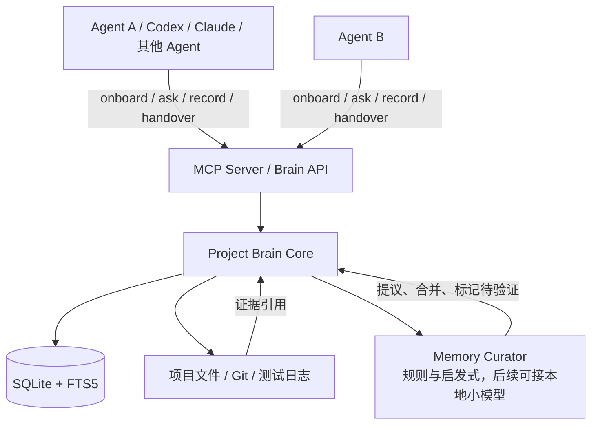
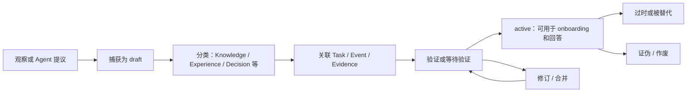
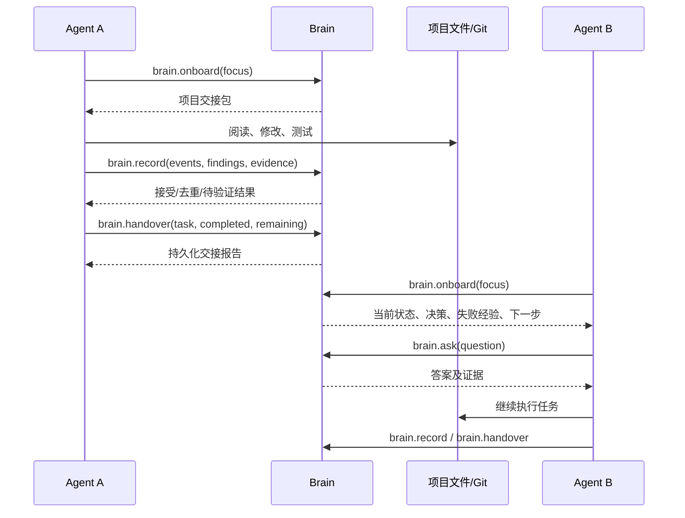

# Project Brain / 跨 Agent 项目大脑

> 版本：v0.1
>
> 状态：MVP 工程方案
>
> 核心命题：**换 Agent，不换脑。**

## 1. 项目定位

Project Brain 是一个独立于具体 Agent 的项目级认知层。它属于项目本身，而不是属于 Codex、Claude、Gemini 或任何单个会话。

Agent 是执行项目工作的“身体”，Project Brain 是持续存在的“共同大脑”。Agent 可以被替换、暂停或并行使用，但项目的身份、状态、知识、经验、决策和证据持续保留，并通过统一协议交接给下一个 Agent。

第一版不把目标定义为“训练一个项目专属大模型”，而是先建立一套可持久化、可查询、可验证、可交接的项目认知基础设施。后续可以在其上接入本地小模型作为 Memory Curator，但模型不是 v0.1 的前置条件。

## 2. 核心理念

```text
传统模式：
Agent A -> 自己理解项目 -> 完成工作 -> 记忆留在会话中
Agent B -> 重新扫描项目 -> 重新踩坑

Project Brain 模式：
Agent A -> Brain.onboard -> 工作 -> Brain.record/handover
Agent B -> Brain.onboard -> 继承项目认知 -> 继续工作
```

Project Brain 追求的不是保存所有历史，而是让项目持续拥有：

- 对“我是谁”的稳定认识：Identity
- 对“现在是什么状态”的及时认识：State
- 对“项目知道什么”的结构化记录：Knowledge
- 对“过去尝试过什么、哪里失败过”的经验：Experience
- 对“为什么这样做”的明确解释：Decision
- 对“哪些内容有证据支持”的判断：Evidence
- 对“接下来做什么”的工作上下文：Task
- 对“发生过什么”的可追溯轨迹：Event

## 3. 要解决的问题

### 3.1 主要问题

1. **上下文断裂**：Agent 会话结束后，重要背景、限制条件和未完成工作丢失。
2. **重复理解**：每个新 Agent 都需要重新阅读项目、猜测当前状态。
3. **失败经验丢失**：失败尝试通常只存在于聊天记录中，下一个 Agent 会重复走弯路。
4. **决策不可追溯**：代码中存在某种实现，但很难知道当初为什么这么做。
5. **事实与猜测混淆**：Agent 的推断、用户陈述、测试结果和正式决策缺少区分。
6. **交接不完整**：即使有 README，也通常无法表达当前任务、阻塞点、已验证内容和推荐下一步。

### 3.2 典型工作交接场景

#### 场景 A：Agent A 开发，Agent B 继续

Agent A 修改了一部分代码，发现一个边界问题，尚未完成验证。Agent B 加入后，通过 `brain.onboard` 直接得到：已完成内容、未完成内容、已知风险、相关决策和下一步建议，不需要从零回顾聊天记录。

#### 场景 B：不同模型负责不同工作

一个 Agent 擅长代码修改，另一个 Agent 擅长分析日志或审查架构。它们共享同一个 Brain：前者记录变更和实验结果，后者读取这些信息并继续分析，最终把审查结论和证据写回 Brain。

#### 场景 C：失败尝试避免重复

某种方案曾经在特定条件下失败。Brain 将其记录为 Experience，并关联日志、测试或 commit。后续 Agent 查询相关问题时，优先得到“曾尝试但失败”的信息，而不是再次提出相同方案。

#### 场景 D：项目暂停后恢复

项目隔了一段时间重新启动。新 Agent 通过 Brain 获得当前目标、最近事件、开放任务、未决问题和项目约束，恢复工作时不依赖某个旧会话是否仍然可访问。

## 4. 目标与非目标

### 4.1 v0.1 目标

- 建立项目级、持久化的 Brain 存储。
- 支持一个项目被多个 Agent 共享。
- 支持新 Agent 快速 onboarding。
- 支持按自然语言问题查询项目认知，并返回相关证据。
- 支持显式记录知识、经验、决策、任务和事件。
- 支持生成可读的工作交接报告。
- 区分事实、观察、推断、决策和验证状态。
- 用一次真实流程证明：**Agent B 能直接接着 Agent A 的工作继续。**

### 4.2 v0.1 非目标

- 不训练或微调项目专属 LLM。
- 不构建复杂的多 Agent 编排平台。
- 不自动理解所有文件和所有 Agent 思考过程。
- 不承诺自动发现全部长期知识。
- 不引入独立向量数据库、知识图谱或分布式存储。
- 不把未经验证的 Agent 输出自动升级为正式决策。
- 不在 MVP 中追求跨机器同步、团队权限和云端部署。
- 不虚构统计指标或 benchmark；验证以真实交接 Demo 和验收标准为准。

## 5. 总体架构



### 5.1 组件职责

| 组件 | 职责 |
|---|---|
| Agent | 执行代码阅读、修改、测试、分析和决策；主动汇报重要结果 |
| MCP Server / API | 为不同 Agent 提供稳定、统一、可发现的接口 |
| Brain Core | 校验输入、写入实体、检索上下文、生成交接摘要、维护关联关系 |
| SQLite + FTS5 | 持久化结构化实体、事件和全文检索索引 |
| 项目文件/Git/日志 | 提供可追溯的外部证据来源 |
| Memory Curator | 判断哪些信息值得长期保存、建议类型和关联；v0.1 以规则为主 |

## 6. Project Brain 核心数据模型

### 6.1 通用字段

所有实体至少包含以下字段：

```json
{
  "id": "实体唯一 ID",
  "type": "实体类型",
  "content": "人类可读内容或结构化载荷",
  "status": "active|draft|proposed|verified|deprecated|invalid",
  "confidence": 0.0,
  "created_at": "ISO-8601 时间",
  "updated_at": "ISO-8601 时间",
  "created_by": "agent 或 user",
  "source_event_ids": [],
  "evidence_ids": [],
  "tags": []
}
```

`confidence` 表示 Brain 对内容当前可信程度的判断，不等于模型准确率，也不替代证据。无法合理判断时可以为 `null`。

### 6.2 Identity：项目身份

描述项目是什么、为什么存在、有哪些核心约束和工程原则。Identity 变化频率低，但每次修改都应留下 Event。

```json
{
  "id": "I-001",
  "type": "identity",
  "name": "SmartGateway",
  "purpose": "工业数据采集网关",
  "architecture": ["STM32", "ESP32", "Linux Gateway"],
  "constraints": ["离线可运行", "低延迟", "资源受限"],
  "principles": ["可靠性优先", "显式状态优于隐式行为"],
  "status": "active"
}
```

### 6.3 State：当前状态

描述项目此刻的短期意识：当前目标、进度、阻塞点、最近变化和开放问题。State 可以被更新，但更新应通过事件记录原因。

```json
{
  "id": "S-001",
  "type": "state",
  "current_goal": "完成 UART DMA 接收链路验证",
  "phase": "验证中",
  "active_task_ids": ["T-003"],
  "blockers": ["硬件压力测试尚未完成"],
  "open_questions": ["高频接收时是否仍存在丢包"],
  "recent_changes": ["已完成 circular DMA 配置"],
  "updated_by": "codex"
}
```

### 6.4 Knowledge：相对稳定的事实、规则和说明

Knowledge 记录项目中的事实、架构说明、约束、约定和可复用规则。它不自动代表正式决策。

```json
{
  "id": "K-012",
  "type": "knowledge",
  "content": "UART 接收由 DMA 缓冲区和 IDLE 中断共同驱动。",
  "scope": "uart",
  "status": "verified",
  "evidence_ids": ["E-004"]
}
```

### 6.5 Experience：尝试、结果和教训

Experience 是 Project Brain 与普通共享笔记的关键区别。它必须能够表达成功、失败、条件和原因。

```json
{
  "id": "X-007",
  "type": "experience",
  "task": "修复 UART 高频接收丢包",
  "attempt": "将 DMA 从 circular mode 改为 normal mode",
  "result": "failed",
  "reason": "连续接收场景下出现数据丢失",
  "conditions": ["高频输入", "连续帧"],
  "lesson": "该方案不适合持续接收场景",
  "evidence_ids": ["E-004"],
  "status": "verified"
}
```

### 6.6 Decision：明确的项目决策

Decision 记录“决定采用什么”和“为什么”。Knowledge 与 Decision 分离，避免 Agent 只能看到结论却不知道决策背景。

```json
{
  "id": "D-003",
  "type": "decision",
  "decision": "UART 接收使用 circular DMA",
  "reason": "满足连续接收需求，并避开 normal DMA 在高频场景下的已知问题",
  "alternatives_considered": ["normal DMA", "纯轮询"],
  "status": "active",
  "verified": true,
  "evidence_ids": ["E-004"]
}
```

### 6.7 Evidence：事实依据

Evidence 是可信度基础。它指向测试结果、日志、文件、commit、用户确认或其他可复核来源。

```json
{
  "id": "E-004",
  "type": "test_result",
  "source": "tests/dma_test.log",
  "description": "高频接收压力测试结果",
  "result": "passed_with_open_risk",
  "commit": "a81c92",
  "captured_at": "2026-08-28T10:30:00+08:00",
  "status": "verified"
}
```

证据来源可以是：

- 项目文件和代码位置
- 测试输出、运行日志和复现步骤
- Git commit、diff 或 issue
- 用户明确确认
- Agent 的观察（默认仅为 `observed`，不自动等于 `verified`）

### 6.8 Task：可交接的工作单元

Task 记录目标、负责人、状态、完成内容、未完成内容和下一步。

```json
{
  "id": "T-003",
  "type": "task",
  "title": "完成 UART DMA 硬件压力测试",
  "status": "in_progress",
  "owner": "agent-a",
  "completed": ["配置 circular DMA", "增加 IDLE 中断处理"],
  "remaining": ["运行硬件压力测试", "记录丢包率"],
  "next_step": "在目标硬件上运行连续帧测试",
  "related_ids": ["D-003", "X-007", "E-004"]
}
```

### 6.9 Event：项目发生过什么

Event 是不可变的时间线记录，用于追踪 Agent 行为和 Brain 状态变化。v0.1 支持显式事件；文件/Git 自动观察属于后续增强。

```json
{
  "id": "EV-021",
  "type": "event",
  "action": "modify_file",
  "agent": "agent-a",
  "session": "session-12",
  "target": "src/uart.c",
  "summary": "修改 DMA 接收缓冲区处理逻辑",
  "timestamp": "2026-08-28T10:20:00+08:00",
  "metadata": {"commit": "a81c92"}
}
```

## 7. Memory 生命周期与可信度机制

### 7.1 生命周期



### 7.2 状态定义

| 状态 | 含义 |
|---|---|
| `draft` | 已捕获但尚未整理 |
| `proposed` | 已分类，等待确认或证据 |
| `observed` | Agent 或工具观察到，但未独立验证 |
| `verified` | 有明确证据或用户确认支持 |
| `active` | 当前可用于工作上下文；可与 verified 同时成立 |
| `deprecated` | 曾有效，但被新信息替代 |
| `invalid` | 已确认错误，不应作为当前建议 |

### 7.3 可信度规则

1. **证据优先**：有可定位来源的测试、日志、代码或用户确认，可信度高于无来源陈述。
2. **事实与推断分开**：`content` 中应明确标识观察、假设、推断和结论。
3. **重要决策必须可追溯**：Decision 至少关联一个 Event、理由或 Evidence；缺失时只能是 `proposed`。
4. **失败经验同样重要**：失败方案不删除，标记为 `invalid` 或 `deprecated`，并保留失败条件。
5. **冲突不静默覆盖**：新旧内容冲突时，保留两条记录，建立 `supersedes` 或 `conflicts_with` 关系。
6. **时间和范围明确**：记录适用范围、版本/commit、发生时间，避免旧经验被无条件泛化。
7. **Agent 不拥有最终记忆**：Agent 可以提议和记录，但 Brain 负责状态校验、关联和生命周期管理。

## 8. Agent ↔ Brain 协议

v0.1 对外优先提供 MCP Server；内部可以使用同样语义的 JSON API。协议设计保持小而稳定，第一阶段只要求实现四个核心方法：`brain.onboard`、`brain.ask`、`brain.record`、`brain.handover`。

### 8.1 通用约定

- 请求必须包含 `project_id` 和 `agent_id`。
- 写入请求包含 `session_id`，便于生成交接记录。
- 所有返回都应尽量包含 `source_ids`、`evidence_ids` 和 `confidence`。
- Brain 返回的是项目上下文，不替 Agent 做最终代码决策。
- 对无法验证的内容，应明确返回 `proposed`/`observed`，不得伪装成事实。

### 8.2 `brain.onboard`

#### 用途

为新 Agent 生成一份受长度约束的项目交接包。它是 Agent 开始工作的第一步。

#### 请求

```json
{
  "project_id": "smart-gateway",
  "agent_id": "agent-b",
  "session_id": "session-13",
  "focus": "UART DMA 接收丢包",
  "token_budget": 1800
}
```

#### 返回

```json
{
  "project_id": "smart-gateway",
  "generated_at": "2026-08-28T11:00:00+08:00",
  "brief": {
    "identity": "工业数据采集网关，资源受限，可靠性优先。",
    "current_state": "UART DMA 已完成初步修改，硬件压力测试待执行。",
    "active_tasks": [
      {"id": "T-003", "title": "完成硬件压力测试", "status": "in_progress"}
    ],
    "important_decisions": [
      {"id": "D-003", "summary": "使用 circular DMA", "evidence_ids": ["E-004"]}
    ],
    "known_failures": [
      {"id": "X-007", "summary": "normal DMA 在高频连续接收时丢包"}
    ],
    "open_questions": ["高频接收时是否仍存在丢包"],
    "recommended_next_step": "在目标硬件上运行连续帧压力测试"
  },
  "source_ids": ["I-001", "S-001", "T-003", "D-003", "X-007", "E-004"],
  "confidence": 0.86
}
```

#### 行为要求

- 默认优先返回 State、active Task、active Decision、已验证 Experience 和开放问题。
- `focus` 不为空时，优先返回与主题相关的记录。
- 不能生成足够上下文时，应返回已有结构化内容和缺失项，而不是编造摘要。

### 8.3 `brain.ask`

#### 用途

用自然语言查询 Brain，并返回答案、依据、相关实体和不确定性。

#### 请求

```json
{
  "project_id": "smart-gateway",
  "agent_id": "agent-b",
  "session_id": "session-13",
  "question": "为什么使用 circular DMA？之前尝试过哪些方案？",
  "scope": ["uart", "dma"],
  "include_evidence": true,
  "limit": 8
}
```

#### 返回

```json
{
  "answer": "当前选择 circular DMA，是因为项目需要连续接收；normal DMA 在高频连续接收场景下曾出现数据丢失。",
  "facts": [
    {"id": "D-003", "type": "decision", "status": "active"},
    {"id": "X-007", "type": "experience", "status": "verified"}
  ],
  "evidence": [
    {"id": "E-004", "source": "tests/dma_test.log", "status": "verified"}
  ],
  "uncertainties": ["硬件压力测试仍需在当前版本重新确认"],
  "confidence": 0.86
}
```

### 8.4 `brain.record`

#### 用途

显式写入 Brain 中值得保留的事实、经验、决策、任务、证据或事件。默认先写入 `draft` 或 `proposed`，由规则和证据决定是否升级。

#### 请求

```json
{
  "project_id": "smart-gateway",
  "agent_id": "agent-b",
  "session_id": "session-13",
  "records": [
    {
      "type": "experience",
      "content": {
        "task": "验证 UART 接收",
        "attempt": "circular DMA + IDLE interrupt",
        "result": "passed",
        "conditions": ["连续帧", "目标硬件"],
        "lesson": "该组合在当前测试条件下工作正常"
      },
      "evidence": [
        {"type": "test_result", "source": "tests/hardware_stress.log"}
      ],
      "status": "proposed"
    },
    {
      "type": "event",
      "action": "run_test",
      "target": "tests/hardware_stress.log",
      "summary": "完成 UART 连续帧压力测试"
    }
  ]
}
```

#### 返回

```json
{
  "accepted": ["X-008", "EV-022", "E-005"],
  "deduplicated": [],
  "needs_verification": ["X-008"],
  "warnings": [],
  "state_updates": ["S-001"]
}
```

### 8.5 `brain.handover`

#### 用途

在 Agent 暂停、结束或转交任务时，生成并持久化交接报告。它既返回给当前 Agent，也成为下一个 Agent 的上下文来源。

#### 请求

```json
{
  "project_id": "smart-gateway",
  "agent_id": "agent-b",
  "session_id": "session-13",
  "task_id": "T-003",
  "status": "partial",
  "completed": ["完成硬件连续帧压力测试", "记录测试日志"],
  "failed": [],
  "discovered": ["当前测试条件下未复现丢包"],
  "remaining": ["补充更高负载测试", "确认 cache coherency 风险"],
  "recommended_next_step": "由下一个 Agent 检查 cache coherency 并运行扩展压力测试",
  "evidence_ids": ["E-005"]
}
```

#### 返回

```json
{
  "handover_id": "H-002",
  "report": {
    "task": "完成 UART DMA 硬件压力测试",
    "status": "partial",
    "completed": ["完成硬件连续帧压力测试", "记录测试日志"],
    "known_failures": [],
    "discoveries": ["当前测试条件下未复现丢包"],
    "remaining": ["补充更高负载测试", "确认 cache coherency 风险"],
    "next_step": "检查 cache coherency 并运行扩展压力测试",
    "evidence": ["E-005"]
  },
  "brain_updates": ["S-001", "T-003", "X-008", "E-005", "EV-023"]
}
```

### 8.6 可选的辅助方法

v0.1 可以预留但不强制实现：

```text
brain.get_state
brain.search
brain.get_decisions
brain.get_experiences
brain.get_tasks
brain.verify
brain.invalidate
```

## 9. Agent 生命周期与工作交接流程



### 标准流程

1. **接入**：Agent 调用 `brain.onboard`，确认项目身份、当前状态和任务边界。
2. **计划**：Agent 检查相关 Decision、Experience 和开放问题，避免重复尝试。
3. **工作**：Agent 阅读文件、修改代码、执行测试或分析日志。
4. **记录**：Agent 用 `brain.record` 写入重要事件、观察、证据和新经验。
5. **验证**：测试结果、用户确认或其他来源将提议升级为 verified/active。
6. **交接**：Agent 调用 `brain.handover`，明确完成、失败、未完成和下一步。
7. **继续**：下一个 Agent 通过 `brain.onboard` 和 `brain.ask` 直接接续工作。

## 10. Local Project Model / Memory Curator

### 10.1 职责

Local Project Model 是后续可以加入的项目原生认知组件；Memory Curator 是它在系统中的具体职责边界。

Memory Curator 不负责替代 Agent 写代码，也不负责直接决定产品方向。它负责：

- 从 Event、Agent 提交和显式记录中识别潜在长期信息。
- 建议实体类型：Knowledge、Experience、Decision、Evidence 等。
- 合并重复记录，发现冲突，关联上下文。
- 判断是否需要验证，以及建议验证步骤。
- 将短期 State 与长期 Memory 分离。
- 为 `brain.onboard` 编译紧凑的项目上下文。
- 为 `brain.ask` 组织答案和证据。

### 10.2 v0.1 的实现方式

v0.1 可以完全不用 LLM：

```text
Event / brain.record
        ↓
规则 + 字段校验 + 关键词/FTS5 检索
        ↓
分类、去重、关联、状态更新
        ↓
Brain
```

第一版只需使用明确规则，例如：

- 包含 `result=failed` 的记录优先归类为 Experience。
- 包含 `decision/reason` 的记录归类为 Decision 提议。
- 包含测试来源、commit 或日志路径的记录创建 Evidence 关联。
- 新内容与旧内容相似时提示去重，而不是静默覆盖。
- 未关联证据的 Decision 默认保持 `proposed`。

### 10.3 后续引入本地小模型

后续可将本地小模型放在 Curator 位置，用于摘要、分类、冲突解释和交接包编译，但必须保留：

- 原始 Event 不可变保存。
- 模型输出先作为 proposal。
- 重要 Decision 仍需证据或人工确认。
- 模型不可覆盖已有证据，只能提出解释或关系。

## 11. 技术选型

### 11.1 推荐方案

| 层 | 选择 | 原因 |
|---|---|---|
| 持久化 | SQLite | 单项目、单机、易备份、零运维 |
| 全文检索 | SQLite FTS5 | 足够支持 v0.1 的关键词和自然语言检索入口 |
| 协议 | MCP Server；可附带 JSON API | 便于不同 Agent 使用统一工具接口 |
| 实现语言 | Python 或 TypeScript | 选择团队最熟悉的一种，避免同时维护多套运行时 |
| 证据 | 文件路径、Git commit、日志引用 | 可追溯且不复制大量项目内容 |
| Embeddings | 可选、延后 | 只有关键词检索不足时再引入 |

### 11.2 SQLite 表的最小设计

```sql
CREATE TABLE memories (
  id TEXT PRIMARY KEY,
  type TEXT NOT NULL,
  status TEXT NOT NULL DEFAULT 'draft',
  content_json TEXT NOT NULL,
  confidence REAL,
  created_by TEXT NOT NULL,
  created_at TEXT NOT NULL,
  updated_at TEXT NOT NULL
);

CREATE TABLE evidence (
  id TEXT PRIMARY KEY,
  type TEXT NOT NULL,
  source TEXT NOT NULL,
  metadata_json TEXT,
  status TEXT NOT NULL DEFAULT 'observed',
  created_at TEXT NOT NULL
);

CREATE TABLE links (
  from_id TEXT NOT NULL,
  relation TEXT NOT NULL,
  to_id TEXT NOT NULL,
  PRIMARY KEY (from_id, relation, to_id)
);

CREATE TABLE events (
  id TEXT PRIMARY KEY,
  action TEXT NOT NULL,
  agent_id TEXT NOT NULL,
  session_id TEXT,
  payload_json TEXT NOT NULL,
  created_at TEXT NOT NULL
);

CREATE VIRTUAL TABLE memory_fts USING fts5(
  id UNINDEXED,
  type UNINDEXED,
  text
);
```

### 11.3 Embeddings 的使用边界

Embeddings 可以作为 FTS5 之后的补充，用于语义相似检索和相似经验发现。但 v0.1 不应因为“以后可能需要语义搜索”而提前引入向量数据库、远程服务或复杂的同步机制。先用 SQLite FTS5 验证交接价值。

## 12. 明确的目录结构

建议将 Brain 作为项目内的隐藏目录，同时将服务实现与项目数据分离：

```text
project/
├── .brain/
│   ├── brain.db              # SQLite 数据库
│   ├── config.json           # 项目标识和可选配置
│   ├── exports/
│   │   └── latest-handover.md
│   └── README.md              # Brain 数据说明
├── brain-server/
│   ├── src/
│   │   ├── server.py|ts
│   │   ├── models.py|ts
│   │   ├── repository.py|ts
│   │   ├── search.py|ts
│   │   ├── curator.py|ts
│   │   └── protocol.py|ts
│   ├── tests/
│   └── README.md
├── docs/
│   └── project-brain-v0.1.md
└── scripts/
    └── brain-demo.py|ts
```

如果不希望将运行时数据库提交到 Git，可以只提交 `.brain/config.json`、导出的交接报告和 schema；数据库文件通过 `.gitignore` 管理。对于单人 MVP，直接保留本地 SQLite 文件也可以。

## 13. 3 小时 MVP 严格范围

### 13.1 必须完成的范围

只做以下闭环：

```text
Git 项目
  + SQLite
  + FTS5
  + 一个 MCP Server
  + 两个模拟 Agent 或两个实际 Agent
  + onboard / ask / record / handover
```

必须支持：

- 初始化一个 Project Brain。
- 写入一份 Identity 和初始 State。
- 记录至少一个 Decision、一个 Experience、一个 Evidence 和一个 Task。
- Agent A 可以记录工作事件和交接报告。
- Agent B 可以通过 onboard 获取交接上下文。
- Agent B 可以通过 ask 查询决策原因或失败经验。
- 所有记录落盘，服务重启后仍可读取。

### 13.2 实现步骤

#### 0:00–0:20：初始化

- 建立目录和 SQLite 数据库。
- 创建最小表结构与 FTS5 索引。
- 写入项目 Identity 和初始 State。

#### 0:20–1:00：数据写入与检索

- 实现 `brain.record`。
- 实现按类型写入和基础字段校验。
- 实现 FTS5 搜索。
- 实现 `brain.ask` 的检索式回答：先返回相关记录、来源和置信状态。

#### 1:00–1:40：Onboarding

- 实现 `brain.onboard`。
- 按固定顺序编译 Identity、State、Task、Decision、Experience、Open Questions。
- 增加长度限制和 focus 过滤。

#### 1:40–2:20：交接

- 实现 `brain.handover`。
- 将完成项、失败项、发现、未完成项和下一步写入 Task/Event。
- 生成 Markdown 交接报告。

#### 2:20–2:45：真实流程验证

- 用 Agent A 完成一个小任务并留下失败尝试。
- Agent A 调用 record 和 handover。
- 启动 Agent B，调用 onboard 和 ask。
- 验证 Agent B 能获得关键上下文。

#### 2:45–3:00：收口

- 修复最明显的协议和数据问题。
- 补充 README、运行示例和验收记录。
- 明确未实现的能力，禁止继续扩展范围。

### 13.3 MVP Demo

Demo 不需要复杂 UI，可以使用 MCP Inspector、CLI 或最小脚本展示以下过程：

1. 创建项目 Brain，写入“项目使用某种架构”和当前任务。
2. Agent A 查询项目背景。
3. Agent A 记录一次失败尝试：某方案在特定条件下失败，并关联日志。
4. Agent A 记录当前决策和下一步，生成 handover。
5. Agent B 加入，调用 `brain.onboard`。
6. Agent B 询问“为什么不采用失败方案”，得到答案和证据。
7. Agent B 继续任务并写回新的测试结果。

Demo 的成功标准是：Agent B 不需要重新阅读 Agent A 的会话，也能知道当前状态、关键历史和下一步。

## 14. 验收标准

### 14.1 功能验收

- [ ] 新项目可以初始化 Brain 数据库。
- [ ] Identity、State、Knowledge、Experience、Decision、Evidence、Task、Event 均有对应存储能力。
- [ ] `brain.onboard` 返回当前项目摘要、活跃任务、重要决策、已知失败和开放问题。
- [ ] `brain.ask` 能返回相关内容、来源 ID、证据 ID 和不确定性。
- [ ] `brain.record` 能写入记录，并对缺失字段、重复记录和无证据决策给出提示。
- [ ] `brain.handover` 能生成持久化交接报告。
- [ ] 服务重启后数据仍然存在。
- [ ] 至少完成一次 Agent A → Agent B 的真实交接 Demo。

### 14.2 质量验收

- [ ] 重要记录可追溯到 Event、文件、日志、commit 或用户确认中的至少一种来源。
- [ ] 未验证内容不会被标记为 verified。
- [ ] 失败经验不会被删除，并能在相关查询中被找到。
- [ ] 新旧冲突不会静默覆盖。
- [ ] 协议输入输出有可读的 JSON 示例或 schema。
- [ ] 运行方式、目录结构和已知限制写入 README。

### 14.3 核心验收问题

> **换一个 Agent 后，项目是否真的感觉像没有换过人？**

v0.1 只有在这个问题得到肯定回答时才算完成。数据库、MCP 和搜索只是实现手段，不是最终价值本身。

## 15. 演进路线

### v0.2：更可靠的项目记忆

- 自动采集 Git commit、diff、测试结果和文件变更 Event。
- 增加 `brain.verify`、`brain.invalidate` 和冲突处理。
- 增加更细的关系：`supports`、`contradicts`、`supersedes`、`related_to`。
- 改进 onboarding 的主题过滤和上下文排序。
- 增加导入/导出、备份和 Markdown 审阅能力。
- 增加轻量 embeddings 作为 FTS5 的可选补充。

### v0.3：Project Model / Memory Curator

- 接入本地小模型完成记录分类、摘要、去重和冲突解释。
- 从 Event 流中主动提出“可能值得保存”的 Memory。
- 生成项目状态变化摘要和周期性交接报告。
- 提供可人工确认的 Memory Review 队列。
- 让 Curator 根据历史失败经验提出验证建议，而不是直接修改代码。

### 更长期方向

- 多项目 Brain 与个人/团队知识边界。
- 多 Agent 并行工作时的任务租约和冲突协调。
- 更强的证据图谱和实验记录。
- 本地项目模型根据项目历史形成稳定的工程偏好和风险识别能力。
- 在保留来源和可验证性的前提下，支持更主动的项目状态维护。

## 16. 风险与关键待讨论问题

### 16.1 主要风险

| 风险 | 说明 | v0.1 应对 |
|---|---|---|
| 错误记忆积累 | Agent 可能记录错误判断 | 默认 proposal；要求证据；保留 invalid 状态 |
| 记忆膨胀 | 所有事件都长期保留会降低可用性 | 区分 Event、State 和长期 Memory；只在 onboarding 中精选 |
| 冲突决策 | 不同 Agent 可能提出矛盾方案 | 不覆盖旧记录；建立冲突关系并要求验证 |
| 上下文过长 | Brain 返回过多内容反而干扰 Agent | focus、limit、token_budget 和优先级排序 |
| 证据失效 | 文件或日志路径可能变化 | 保存 commit、时间和描述；后续增加证据健康检查 |
| 过度自动化 | Curator 可能把猜测变成事实 | v0.1 不用 LLM；后续模型输出只能是 proposal |
| 技术范围失控 | 过早引入 RAG、图数据库或编排框架 | 严守 SQLite + FTS5 + 四个核心方法 |
| 多人并发写入 | 后续可能产生锁和权限问题 | v0.1 先限定为单机单项目；后续再设计并发模型 |

### 16.2 关键待讨论问题

1. **主动观察还是被动记录？** v0.1 推荐混合路线的被动子集：先支持显式 `record`，再逐步接入 Git 和测试观察。
2. **谁有权确认 Decision？** 单人项目可由用户确认；团队项目需要角色、审批或签名机制。
3. **Brain 的边界是什么？** 哪些信息属于项目，哪些属于个人偏好或 Agent 私有上下文？
4. **State 如何更新？** 是由 Agent 显式更新，还是由 Task/Event 规则推导？v0.1 可采用显式更新加事件留痕。
5. **证据如何判断过期？** 测试结果、代码位置和依赖变化后，是否需要自动降级置信度？
6. **是否需要版本化 Brain？** 未来可能需要按 Git 分支、commit 或时间点恢复项目认知。
7. **本地模型放在哪里？** Curator 应是可替换组件，不能让核心存储和协议依赖某个模型或供应商。
8. **如何衡量“交接成功”？** v0.1 用真实任务复盘和验收清单；后续再定义更系统的可观测指标。

## 17. 结论

Project Brain v0.1 的任务不是创造一个全能 AI，而是建立一个属于项目本身的持续认知层：

```text
Agent 是执行者
Event 是感知
State 是短期意识
Knowledge 是事实与规则
Experience 是成功与失败的积累
Decision 是带理由的选择
Evidence 是可信度基础
Task 是可交接的工作单元
```

最小可行实现应坚持一个判断标准：

> **Agent 可以更换，但项目不应该因此失忆。**

先用 SQLite、FTS5、MCP 和明确的数据模型跑通一次真实交接，再决定是否需要 embeddings、本地小模型或更复杂的 Project Model。这条路线既能在 3 小时内交付可用 MVP，也为后续的 Memory Curator 和项目原生模型保留清晰演进空间。
